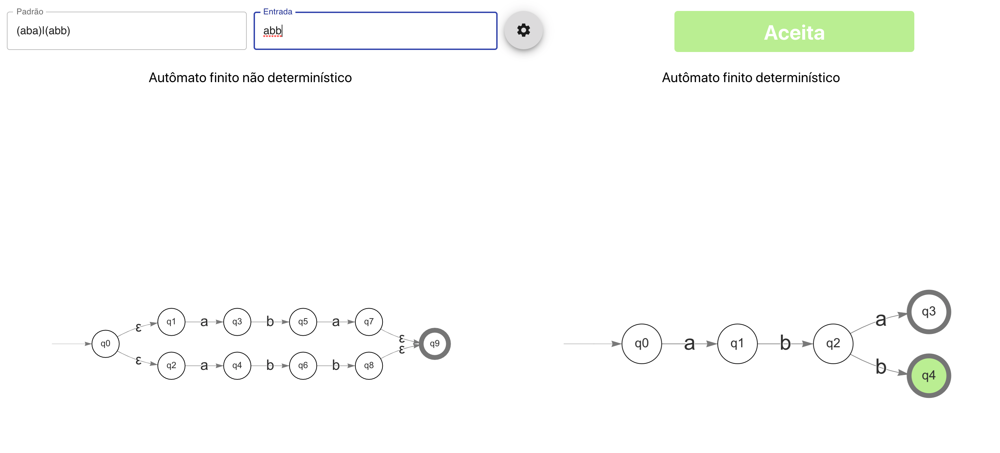

# reCreator
reCreator é uma ferramenta para aprender como as Expressões Regulares funcionam usando
Autômatos Finitos (determinísticos e não determinísticos)



## API Regras

**a+**    Um ou mais a's

**a***    Zero ou mais a's

**a?**    Zero ou um a

**(...)** Encapsula expressão

**a|b**   a ou b

**\w**    [a-zA-Z0-9_]

**\d**    [0-9]

**[a-z]** Qualquer caractere entre a-z

## Desenvolvimento
```bash
// instalar dependências
yarn install

// testes
yarn test

// iniciar aplicação
yarn start

// criar build
yarn build
```

## Contribuindo

1. Faça Fork do repositório no GitHub
2. Clone o projeto para sua máquina
3. Faça commit das alterações para sua branch
4. Faça push para seu repositório
5. Envie uma Pull Request
